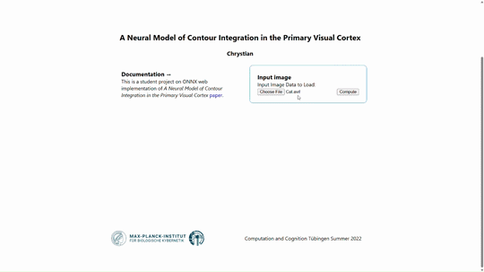

# V1 Saliency Hypothesis Web App

This project is a web-based implementation of the V1 Saliency Hypothesis (V1SH) model. It allows users to upload an image and see the model's saliency predictions in real-time. The core of this project is the custom V1SH model, which was created using PyTorch and then exported to the ONNX format for use in the browser.

## Demo

You can try out the live application here: [https://chrysophyt.github.io/v1sh](https://chrysophyt.github.io/v1sh)



## What is the V1 Saliency Hypothesis?

The V1 Saliency Hypothesis is a model of visual attention that is inspired by the human brain. It suggests that the primary visual cortex (V1) in the brain creates a "saliency map" that guides our attention to the most important parts of an image. This project implements a V1SH model that uses Gabor filters and a neural network to create a saliency map for a given image.

## Project Structure

*   `V1SHNetPyTorchONNX.ipynb`: The Jupyter notebook used to create and export the ONNX models.
*   `pages/v1sh/index.js`: The main page of the web application.
*   `utils/runInference.js`: The utility script that runs the ONNX model in the browser.
*   `public/`: This directory contains the ONNX models.

## Getting Started

First, install the dependencies:

```bash
npm install
```

Then, run the development server:

```bash
npm run dev
```

Open [http://localhost:3000/v1sh](http://localhost:3000/v1sh) with your browser to see the result.

## Tech Stacks used

*   **Machine Learning:**
    *   **PyTorch:** The V1SH model was built and trained using PyTorch.
    *   **ONNX:** The PyTorch model was converted to the ONNX format to enable cross-platform inference.
    *   **Computer Vision:** The V1SH model is a computer vision model that predicts saliency in images.
*   **Web Development:**
    *   **Next.js:** The web application is built using Next.js, a popular React framework.
    *   **React:** The user interface is built with React.
    *   **ONNX Runtime Web:** The ONNX model is run in the browser using the ONNX Runtime Web library.
    *   **JavaScript:** The front-end logic is written in JavaScript.
